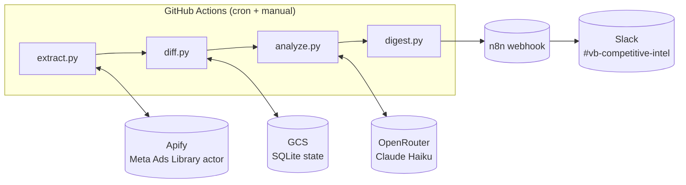

# VendorBids Competitive Intel

Weekly Slack digest of competitor advertising activity, sourced from Meta Ads Library. Detects new ads, ended ads, messaging shifts, and theme changes across NetVendor, Revyse, and other multifamily-adjacent competitors. Runs on GitHub Actions, costs about $36/month all-in.

Built for HappyCo's VendorBids team to keep Suki (brand) and Jindou informed about competitive positioning without anyone manually watching the Ads Library.

## What it does

Every Monday at 8am PT, the pipeline:

1. Pulls the latest ads from each configured competitor's Meta Ads Library page via Apify
2. Diffs against the prior week's snapshot to identify new ads, ended ads, and messaging changes
3. Sends new and changed creative through Claude Haiku (via OpenRouter) for theme extraction and threat assessment
4. Posts a Block Kit digest to `#vb-competitive-intel` via n8n webhook

If nothing meaningful happened that week, it stays silent. Signal over noise.

## Architecture



State lives in SQLite (with FTS5 for later historical search), synced to GCS between runs. Everything else is stateless.

## Repo structure

```
vendorbids-competitive-intel/
├── .github/workflows/
│   ├── weekly-digest.yml         # scheduled + workflow_dispatch
│   └── backfill.yml              # one-time 90-day historical seed
├── src/
│   ├── main.py                   # entrypoint, orchestrates all stages
│   ├── extract.py                # Apify API client
│   ├── diff.py                   # SQLite state + change detection
│   ├── analyze.py                # LLM synthesis via OpenRouter
│   ├── digest.py                 # Slack Block Kit builder
│   └── storage.py                # GCS sync for SQLite state
├── config/
│   └── competitors.yaml          # competitor list, threat levels, page IDs
├── prompts/
│   └── weekly_analysis.md        # LLM analysis prompt template
├── state/
│   └── ads.db                    # local dev only, prod syncs to GCS
├── .env.example
├── requirements.txt
└── README.md
```

## Prerequisites

- Python 3.12+
- Apify account with the Starter plan or higher (residential proxies required for Meta scraping)
- OpenRouter API key with Claude Haiku access
- GCS bucket + service account key for SQLite state sync
- n8n workflow with a webhook trigger that posts to Slack
- A Slack channel (`#vb-competitive-intel` by convention) with the n8n integration granted post permission

## Setup

```bash
git clone <repo-url> vendorbids-competitive-intel
cd vendorbids-competitive-intel

python -m venv .venv
source .venv/bin/activate
pip install -r requirements.txt

cp .env.example .env
# Fill in APIFY_TOKEN, OPENROUTER_KEY, N8N_WEBHOOK_URL, GCS_BUCKET, GCS_KEY_JSON

# Run once locally to verify plumbing
python -m src.main --dry-run

# Backfill 90 days of historical ads so week-one diffs have context
python -m src.main --backfill 90
```

For production, all secrets go into GitHub repo secrets under Settings → Secrets and variables → Actions. The workflow file below reads them from `${{ secrets.* }}`.

## Configuration

`config/competitors.yaml`:

```yaml
competitors:
  - name: NetVendor
    threat_level: critical
    fb_page_id: "REPLACE_WITH_ACTUAL_PAGE_ID"
    ad_library_url: "https://www.facebook.com/ads/library/?active_status=all&ad_type=all&country=US&view_all_page_id=REPLACE_WITH_ACTUAL_PAGE_ID"
    notes: "Launched integrated vendor bidding March 2026, 100K vendor head start. Direct VendorBids competitor."

  - name: Revyse
    threat_level: critical
    fb_page_id: "REPLACE"
    ad_library_url: "..."
    notes: "Revyse Vendor Intelligence: AI contract mgmt + vendor discovery layer. Marketplace piece overlaps VendorBids directly."

  - name: ServiceTitan
    threat_level: adjacent
    fb_page_id: "REPLACE"
    ad_library_url: "..."
    notes: "Vendor-side platform. Adjacent because they serve the trades, not multifamily operators directly."

  - name: Procore
    threat_level: adjacent
    fb_page_id: "REPLACE"
    ad_library_url: "..."

  - name: HqO
    threat_level: watch
    fb_page_id: "REPLACE"
    ad_library_url: "..."

  - name: Yardi
    threat_level: watch
    fb_page_id: "REPLACE"
    ad_library_url: "..."

  - name: RealPage
    threat_level: watch
    fb_page_id: "REPLACE"
    ad_library_url: "..."

  - name: AppFolio
    threat_level: watch
    fb_page_id: "REPLACE"
    ad_library_url: "..."

  - name: Entrata
    threat_level: watch
    fb_page_id: "REPLACE"
    ad_library_url: "..."
```

**Threat levels drive digest behavior:**

- `critical`: always gets its own section in the digest, even for "steady state" weeks (the absence of activity is itself signal)
- `adjacent`: gets a section only when something changed
- `watch`: gets a single-line summary rolled up at the bottom

**Finding page IDs:** navigate to any competitor's Facebook page, view page source, search for `"pageID"`. Or use the Ad Library search: enter the company name, click through to their ads, and grab `view_all_page_id` from the URL.

## Data model

`state/ads.db` schema:

```sql
CREATE TABLE ads (
  ad_id TEXT PRIMARY KEY,
  competitor TEXT NOT NULL,
  first_seen DATE NOT NULL,
  last_seen DATE NOT NULL,
  status TEXT NOT NULL,              -- 'active' | 'ended'
  creative_body TEXT,
  creative_title TEXT,
  cta_text TEXT,
  image_url TEXT,
  video_url TEXT,
  platforms TEXT,                    -- JSON array: FB, IG, Threads, Audience Network
  start_date DATE,
  end_date DATE,
  raw_json TEXT NOT NULL             -- full Apify payload for later reprocessing
);

CREATE INDEX idx_ads_competitor ON ads(competitor);
CREATE INDEX idx_ads_status ON ads(status);
CREATE INDEX idx_ads_last_seen ON ads(last_seen);

CREATE VIRTUAL TABLE ads_fts USING fts5(
  creative_body, creative_title, cta_text,
  content='ads', content_rowid='rowid'
);

CREATE TABLE weekly_snapshots (
  week_of DATE NOT NULL,
  competitor TEXT NOT NULL,
  active_count INTEGER,
  new_count INTEGER,
  ended_count INTEGER,
  themes_json TEXT,                  -- LLM-generated theme cluster
  shift_summary TEXT,                -- LLM narrative
  threat_score INTEGER,              -- 1-5 from LLM
  headline TEXT,
  PRIMARY KEY (week_of, competitor)
);

CREATE TABLE pipeline_runs (
  run_id TEXT PRIMARY KEY,
  started_at TIMESTAMP,
  completed_at TIMESTAMP,
  status TEXT,                       -- 'success' | 'partial' | 'failed'
  competitors_processed INTEGER,
  competitors_failed INTEGER,
  error_log TEXT
);
```

FTS5 enables historical search like "has Revyse ever mentioned Yardi integration?" without needing to re-run LLM classification.

## How it works

### Extract

`src/extract.py` uses `apify/facebook-ads-scraper` at $3.40/1K ads. This is the official Apify actor, chosen over cheaper community alternatives because the Ads Library UI changes quarterly and the official actor gets patched fastest.

```python
import os, requests, time

APIFY_TOKEN = os.environ["APIFY_TOKEN"]
ACTOR_ID = "apify/facebook-ads-scraper"

def scrape_competitor(competitor: dict) -> list[dict]:
    """Run Apify actor for one competitor, poll until done, return ads."""
    run = requests.post(
        f"https://api.apify.com/v2/acts/{ACTOR_ID}/runs",
        headers={"Authorization": f"Bearer {APIFY_TOKEN}"},
        json={
            "urls": [{"url": competitor["ad_library_url"]}],
            "count": 500,
            "scrapeAdDetails": True,
            "activeStatus": "all",
        },
        timeout=30,
    ).json()

    run_id = run["data"]["id"]
    dataset_id = run["data"]["defaultDatasetId"]

    # Poll every 10s, timeout after 15 minutes
    deadline = time.time() + 900
    while time.time() < deadline:
        status = requests.get(
            f"https://api.apify.com/v2/actor-runs/{run_id}",
            headers={"Authorization": f"Bearer {APIFY_TOKEN}"},
            timeout=30,
        ).json()["data"]["status"]
        if status == "SUCCEEDED":
            break
        if status in ("FAILED", "TIMED-OUT", "ABORTED"):
            raise RuntimeError(f"Apify run {run_id} ended with status {status}")
        time.sleep(10)
    else:
        raise TimeoutError(f"Apify run {run_id} did not complete in 15 minutes")

    items = requests.get(
        f"https://api.apify.com/v2/datasets/{dataset_id}/items",
        headers={"Authorization": f"Bearer {APIFY_TOKEN}"},
        timeout=60,
    ).json()

    return items
```

### Diff

`src/diff.py` compares the fresh scrape against SQLite state and emits three sets: new ads (first time we've seen them), ended ads (previously active, now missing), and still-active ads (unchanged).

```python
import sqlite3, json
from datetime import date

def compute_diff(competitor: str, scraped_ads: list[dict], db: sqlite3.Connection) -> dict:
    today = date.today().isoformat()
    scraped_ids = {ad["ad_archive_id"] for ad in scraped_ads}

    cursor = db.execute(
        "SELECT ad_id FROM ads WHERE competitor = ? AND status = 'active'",
        (competitor,),
    )
    known_active_ids = {row[0] for row in cursor}

    new_ads = [a for a in scraped_ads if a["ad_archive_id"] not in known_active_ids]
    ended_ids = known_active_ids - scraped_ids

    ended_ads = []
    for ad_id in ended_ids:
        row = db.execute("SELECT * FROM ads WHERE ad_id = ?", (ad_id,)).fetchone()
        ended_ads.append(dict(row))
        db.execute(
            "UPDATE ads SET status = 'ended', end_date = ?, last_seen = ? WHERE ad_id = ?",
            (today, today, ad_id),
        )

    for ad in scraped_ads:
        db.execute("""
            INSERT INTO ads (ad_id, competitor, first_seen, last_seen, status,
                           creative_body, creative_title, cta_text, image_url,
                           video_url, platforms, start_date, raw_json)
            VALUES (?, ?, ?, ?, 'active', ?, ?, ?, ?, ?, ?, ?, ?)
            ON CONFLICT(ad_id) DO UPDATE SET
                last_seen = excluded.last_seen,
                status = 'active'
        """, (
            ad["ad_archive_id"], competitor, today, today,
            ad.get("body"), ad.get("title"), ad.get("cta_text"),
            ad.get("image_url"), ad.get("video_url"),
            json.dumps(ad.get("platforms", [])),
            ad.get("start_date"), json.dumps(ad),
        ))

    db.commit()

    return {
        "new": new_ads,
        "ended": ended_ads,
        "active_count": len(scraped_ids),
        "prev_active_count": len(known_active_ids),
    }
```

### Analyze

This is where the "wow" comes from. The prompt determines whether the digest reads like a status report (boring) or a strategic briefing (useful).

`prompts/weekly_analysis.md`:

```markdown
You are a competitive intelligence analyst for VendorBids, a multifamily
vendor-operator matching product built by HappyCo. You review a competitor's
Meta advertising activity from the past week and generate a briefing for the
VendorBids GTM team (Suki on brand, Jindou on strategy, Santi on GTM).

## Competitor context
{competitor_name} - threat level {threat_level}
{competitor_notes}

## This week's activity
Week of: {week_of}
New ads launched: {new_ads_count}
Ads ended: {ended_ads_count}
Total currently active: {active_count}
Previous week active: {prev_active_count}

## New ads (full creative)
{new_ads_full_json}

## Ended ads (creative + how long they ran)
{ended_ads_json}

## Historical themes for context (last 4 weeks)
{prior_themes}

## Your task
Return ONLY a JSON object with these fields:

1. `headline` - one sentence. What is the single most important thing that
   happened this week? If nothing meaningful, exactly: "steady state, no
   notable changes."

2. `themes` - 2-4 short theme tags describing this week's messaging.
   Examples: "faster vendor payments", "Yardi integration", "cost savings
   for operators", "AI-powered matching".

3. `messaging_shift` - did the theme mix shift from previous weeks? One
   sentence describing the change, or null.

4. `icp_signal` - who are they targeting? One of: "operators", "vendors",
   "both", "unclear". Cite creative body text as evidence in one phrase.

5. `threat_assessment` - integer 1-5, where 1 is noise and 5 is act on this
   immediately. Include reasoning in one sentence.

6. `notable_creatives` - array of up to 3 ad_ids Suki should review for
   messaging reference.

7. `suggested_action` - one sentence: what should the VendorBids team do
   with this information, if anything? Or null if no action warranted.

Do not use em dashes. Use commas or parentheses instead. Do not use the
word "marketplace" to describe VendorBids (competitors may use it about
themselves, which is fine to quote). Refer to VendorBids customers as
"multifamily operators" or "operators". "Multifamily" is one word.
```

`src/analyze.py` calls OpenRouter with this prompt per competitor, per week. At Claude Haiku pricing, this runs about $0.001 per competitor per week, so under $0.50/month total LLM spend across all competitors.

```python
import os, json, requests
from pathlib import Path

OPENROUTER_KEY = os.environ["OPENROUTER_KEY"]
PROMPT_PATH = Path(__file__).parent.parent / "prompts" / "weekly_analysis.md"

def analyze_competitor(competitor: dict, diff: dict, prior_themes: list) -> dict:
    prompt = PROMPT_PATH.read_text().format(
        competitor_name=competitor["name"],
        threat_level=competitor["threat_level"],
        competitor_notes=competitor.get("notes", ""),
        week_of=diff["week_of"],
        new_ads_count=len(diff["new"]),
        ended_ads_count=len(diff["ended"]),
        active_count=diff["active_count"],
        prev_active_count=diff["prev_active_count"],
        new_ads_full_json=json.dumps(diff["new"], indent=2),
        ended_ads_json=json.dumps(diff["ended"], indent=2),
        prior_themes=json.dumps(prior_themes),
    )

    response = requests.post(
        "https://openrouter.ai/api/v1/chat/completions",
        headers={"Authorization": f"Bearer {OPENROUTER_KEY}"},
        json={
            "model": "anthropic/claude-haiku-4.5",
            "messages": [{"role": "user", "content": prompt}],
            "response_format": {"type": "json_object"},
            "temperature": 0.3,
        },
        timeout=60,
    ).json()

    return json.loads(response["choices"][0]["message"]["content"])
```

### Digest

`src/digest.py` composes a Slack Block Kit message and POSTs it to the n8n webhook.

```python
import os, requests

N8N_WEBHOOK_URL = os.environ["N8N_WEBHOOK_URL"]

def build_digest(week_of: str, analyses: list[dict]) -> dict:
    critical = [a for a in analyses if a["competitor"]["threat_level"] == "critical"]
    adjacent = [a for a in analyses if a["competitor"]["threat_level"] == "adjacent"]
    watch = [a for a in analyses if a["competitor"]["threat_level"] == "watch"]

    active_signals = [a for a in analyses if a["headline"] != "steady state, no notable changes."]
    if not active_signals:
        return None  # skip post entirely if nothing happened anywhere

    blocks = [
        {
            "type": "header",
            "text": {"type": "plain_text", "text": f"VendorBids competitive watch, week of {week_of}"},
        },
        {
            "type": "section",
            "text": {
                "type": "mrkdwn",
                "text": f"*{len(active_signals)} competitors had notable activity this week.* "
                        f"Highest threat: {max(a['threat_assessment'] for a in active_signals)}/5.",
            },
        },
        {"type": "divider"},
    ]

    for a in critical:
        alert = ":rotating_light: " if a["threat_assessment"] >= 4 else ""
        blocks.extend([
            {
                "type": "section",
                "text": {
                    "type": "mrkdwn",
                    "text": f"{alert}*{a['competitor']['name']}* (threat {a['threat_assessment']}/5)\n"
                            f"{a['headline']}",
                },
            },
            {
                "type": "context",
                "elements": [{
                    "type": "mrkdwn",
                    "text": f"New: {len(a['diff']['new'])}  ·  Ended: {len(a['diff']['ended'])}  ·  "
                            f"Active: {a['diff']['active_count']}  ·  "
                            f"Targeting: {a['icp_signal']}",
                }],
            },
            {
                "type": "context",
                "elements": [{
                    "type": "mrkdwn",
                    "text": f"Themes: {' · '.join(a['themes'])}",
                }],
            },
        ])
        if a.get("messaging_shift"):
            blocks.append({
                "type": "section",
                "text": {"type": "mrkdwn", "text": f"_Shift:_ {a['messaging_shift']}"},
            })
        if a.get("suggested_action"):
            blocks.append({
                "type": "section",
                "text": {"type": "mrkdwn", "text": f":arrow_right: {a['suggested_action']}"},
            })
        # Show up to 2 notable creatives as image blocks
        for ad_id in a.get("notable_creatives", [])[:2]:
            ad = next((x for x in a["diff"]["new"] if x["ad_archive_id"] == ad_id), None)
            if ad and ad.get("image_url"):
                blocks.append({
                    "type": "image",
                    "image_url": ad["image_url"],
                    "alt_text": (ad.get("body") or "")[:80],
                })
        blocks.append({
            "type": "actions",
            "elements": [{
                "type": "button",
                "text": {"type": "plain_text", "text": "View in Ads Library"},
                "url": a["competitor"]["ad_library_url"],
            }],
        })
        blocks.append({"type": "divider"})

    # Adjacents get a one-line summary each, only if active
    adjacent_lines = [f"*{a['competitor']['name']}:* {a['headline']}"
                     for a in adjacent if a["headline"] != "steady state, no notable changes."]
    if adjacent_lines:
        blocks.append({
            "type": "section",
            "text": {"type": "mrkdwn", "text": "*Adjacent competitors:*\n" + "\n".join(adjacent_lines)},
        })

    # Watch list rolled up into one context block
    watch_active = [a["competitor"]["name"] for a in watch if a["headline"] != "steady state, no notable changes."]
    if watch_active:
        blocks.append({
            "type": "context",
            "elements": [{"type": "mrkdwn", "text": f"Watch list activity: {', '.join(watch_active)}"}],
        })

    return {"blocks": blocks}


def post_to_slack(digest: dict) -> None:
    if digest is None:
        print("No notable activity this week, skipping post.")
        return
    r = requests.post(N8N_WEBHOOK_URL, json=digest, timeout=30)
    r.raise_for_status()
```

Slack Block Kit is POSTed as-is; n8n's webhook is configured to pass the `blocks` array through to `chat.postMessage`.

## Deployment

`.github/workflows/weekly-digest.yml`:

```yaml
name: Weekly competitive digest

on:
  schedule:
    - cron: "0 15 * * 1"       # Monday 15:00 UTC = 8am PT (7am during DST)
  workflow_dispatch:            # manual trigger for testing

jobs:
  digest:
    runs-on: ubuntu-latest
    timeout-minutes: 30
    steps:
      - uses: actions/checkout@v4

      - uses: actions/setup-python@v5
        with:
          python-version: "3.12"
          cache: "pip"

      - run: pip install -r requirements.txt

      - name: Sync SQLite from GCS
        env:
          GCS_BUCKET: ${{ secrets.GCS_BUCKET }}
          GCS_KEY_JSON: ${{ secrets.GCS_KEY_JSON }}
        run: python -m src.storage pull

      - name: Run pipeline
        env:
          APIFY_TOKEN: ${{ secrets.APIFY_TOKEN }}
          OPENROUTER_KEY: ${{ secrets.OPENROUTER_KEY }}
          N8N_WEBHOOK_URL: ${{ secrets.N8N_WEBHOOK_URL }}
        run: python -m src.main

      - name: Sync SQLite back to GCS
        if: always()             # even on partial failure, save state
        env:
          GCS_BUCKET: ${{ secrets.GCS_BUCKET }}
          GCS_KEY_JSON: ${{ secrets.GCS_KEY_JSON }}
        run: python -m src.storage push

      - name: Post failure heads-up to Slack
        if: failure()
        env:
          N8N_WEBHOOK_URL: ${{ secrets.N8N_WEBHOOK_URL }}
        run: |
          curl -X POST "$N8N_WEBHOOK_URL" \
            -H "Content-Type: application/json" \
            -d '{"blocks":[{"type":"section","text":{"type":"mrkdwn","text":":warning: *Competitive intel pipeline failed this week.* Check GitHub Actions logs."}}]}'
```

`.github/workflows/backfill.yml` is nearly identical but runs on `workflow_dispatch` only, accepts a `days` input, and calls `python -m src.main --backfill $DAYS` instead of the standard run.

`requirements.txt`:

```
requests==2.32.3
pyyaml==6.0.2
google-cloud-storage==2.18.2
python-dateutil==2.9.0
```

`.env.example`:

```
APIFY_TOKEN=apify_api_...
OPENROUTER_KEY=sk-or-v1-...
N8N_WEBHOOK_URL=https://happyco-n8n.up.railway.app/webhook/...
GCS_BUCKET=vb-competitive-intel-state
GCS_KEY_JSON={"type":"service_account",...}
```

## Cost model

At 10 competitors averaging 50 ads each per week (500 ads/week, 26K/year):

| Line item | Monthly cost |
|-----------|-------------:|
| Apify Starter plan (residential proxies included) | $29.00 |
| Apify actor events (26K ads/year at $3.40/1K) | $7.30 |
| OpenRouter (Claude Haiku, ~40 analyses/month) | $0.50 |
| GCS storage (SQLite state, well under 1GB) | $0.02 |
| GitHub Actions (well under free tier at 5min/week) | $0.00 |
| **Total** | **~$36.82** |

Compare to a Clay seat at $149/mo, or Crayon at $600/mo minimum. This is order-of-magnitude cheaper for a narrower, sharper output.

## Two-week build plan

### Week 1: pipeline plumbing

| Day | Deliverable |
|-----|-------------|
| 1 | Repo scaffold, `competitors.yaml` populated with NetVendor + Revyse page IDs, secrets in GitHub Actions |
| 2 | `extract.py` working end-to-end against NetVendor, results printed to console |
| 3 | SQLite schema + `diff.py`, GCS state sync working |
| 4 | Plain-text `digest.py` (no LLM yet), n8n webhook verified with a real Slack post |
| 5 | `weekly-digest.yml` workflow, first end-to-end manual run via `workflow_dispatch` |

**Week 1 milestone:** a plaintext "here are NetVendor's new ads this week" digest posts to Slack when you click Run. Not impressive yet, but the plumbing is solid.

### Week 2: intelligence layer

| Day | Deliverable |
|-----|-------------|
| 6-7 | `analyze.py` + prompt template, tuned against real week-1 data |
| 8 | Rebuild `digest.py` with Block Kit + LLM analysis output |
| 9 | Add remaining 8 competitors, tune theme consistency across all of them |
| 10 | Schedule Monday 8am cron, write ops runbook, hand off first "real" digest to Jindou and Suki |

**Week 2 milestone:** Monday morning, Jindou opens Slack, sees a polished briefing with theme tags, threat scores, creative previews, and a "here's what to do about it" line per critical competitor.

## Operational notes

**Ads Library UI changes** break scrapers roughly quarterly. The workflow catches actor failures and posts a "digest skipped this week, check the logs" heads-up to Slack rather than failing silently. When it happens, update the Apify actor to the latest version and re-run manually.

**LLM classification drift.** Theme tags will get inconsistent over time (one week "faster payments", the next "quick vendor pay", the week after "instant payouts"). Every 4-6 weeks, feed the last month of themes back through Haiku with a normalization prompt, then update the canonical vocabulary in `weekly_analysis.md` under a "preferred theme tags" section. Costs about a dollar every six weeks.

**Slack fatigue.** If two consecutive weeks produce "steady state" across all competitors, the pipeline stays silent. When it does post, that itself signals something happened.

**Backfill before first live run.** The `backfill.yml` workflow pulls 90 days of ads for every competitor so week-one diffs have historical context. Without it, everything looks "new" on the first Monday and the digest is meaningless. Run it once, manually, before enabling the schedule.

**Rate limits.** Apify has generous rate limits on the Starter plan but the Ads Library scraper itself can hit Meta's anti-bot layer if you scrape too many pages simultaneously. Serialize competitor scrapes (don't parallelize), and space runs at least 60 seconds apart. The current design does this by default.

**Compliance posture.** Meta Ads Library is published by Meta itself specifically for transparency purposes, so scraping it is the safest Meta surface from a ToS perspective. No login required, no residential proxy needed for the Ads Library specifically (though Apify uses them anyway on the Starter plan). Nothing here touches user data, private pages, or gated content.

## Roadmap: LinkedIn extension

Same pipeline architecture, second data source. Because extract, diff, analyze, and digest are already generalized, adding LinkedIn is roughly 2-3 additional days of work once the Meta pipeline is stable.

**Actors:**
- `harvestapi/linkedin-company-scraper` at $3/1K companies for monthly firmographic snapshots of HappyCo's 271 customers plus the top-priority prospect list
- `curious_coder/linkedin-post-search-scraper` for post activity from named executives at those accounts

**Schema additions:**
```sql
CREATE TABLE company_snapshots (
  company_id TEXT NOT NULL,
  snapshot_date DATE NOT NULL,
  employee_count INTEGER,
  headcount_change_30d INTEGER,
  recent_hires_json TEXT,
  recent_departures_json TEXT,
  PRIMARY KEY (company_id, snapshot_date)
);

CREATE TABLE linkedin_posts (
  post_id TEXT PRIMARY KEY,
  author_id TEXT,
  author_company TEXT,
  posted_at TIMESTAMP,
  content TEXT,
  signal_type TEXT,                  -- LLM-classified
  engagement_count INTEGER,
  raw_json TEXT
);
```

**New prompt** in `prompts/linkedin_analysis.md` classifies posts into signal types: `capex_signal`, `hiring_signal`, `procurement_pain`, `product_evaluation`, `portfolio_change`, or `noise`.

**Digest gets a second section:** "Named-account activity" showing hot posts from executives at target operators plus notable headcount or hiring shifts.

Everything else (SQLite state, GCS sync, GitHub Actions runtime, n8n Slack routing, Block Kit builder) stays identical.

## FAQ

**Why not just check Ads Library manually?** Because nobody will. A weekly automated digest at $36/month is cheaper than 15 minutes of Suki's or Jindou's time every week, and it produces better analysis because the LLM sees all competitors at once and can spot cross-cutting themes.

**Why n8n instead of posting to Slack directly?** Matches the existing HappyCo automation stack. Keeps Slack credentials in one place. Lets you extend later (send certain alerts to email, log to BigQuery, etc.) without touching the pipeline code.

**Why SQLite instead of BigQuery for state?** Simpler, cheaper, more portable. Total state is a few MB even after years of running. If VendorBids ever wants to join competitive intel data against internal metrics in BigQuery, add a nightly SQLite-to-BQ export as a separate workflow, don't rebuild the state layer.

**Why Claude Haiku instead of GPT-4o-mini or Gemini Flash?** Interchangeable at this scale, all three cost similar amounts. Haiku picked because the analysis prompt is tuned to Claude's style. Swap the OpenRouter model string if pricing shifts.

**How do I add a new competitor?** Add an entry to `competitors.yaml`, get the page ID, commit, and run the backfill workflow with `days: 90` for that competitor only (the workflow accepts a `--competitor` filter for this).

**What if Meta shuts down the Ads Library?** They won't (it's regulated in the EU), but if it changed significantly, the LinkedIn extension becomes the primary pipeline and Meta becomes optional.
