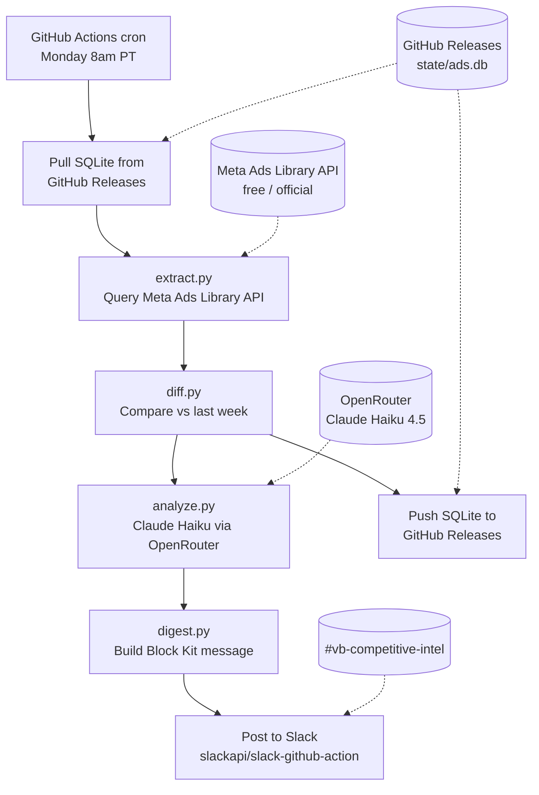

# VendorBids Competitive Intel Pipeline

Implementation-ready plan for a weekly competitive ad monitoring pipeline using the Meta Ads Library API, GitHub Actions, and Slack.

**Cost: ~$0.50/month** (LLM analysis only; everything else is free-tier).

---

## How it works (plain English)

Every Monday at 8am PT, a GitHub Actions workflow:

1. Downloads last week's ad database from GitHub Releases
2. Queries Meta's Ads Library API for each competitor's current ads
3. Compares against last week's snapshot: what's new, what ended, what changed
4. Sends each competitor's changes to Claude Haiku for theme/threat analysis
5. Posts a threaded Slack digest: summary message + one thread reply per active competitor
6. Uploads the updated database back to GitHub Releases

If nothing changed across all competitors, it stays silent.

---

## Architecture



**No n8n. No GCS. No Apify.** Four free services (Meta API, GitHub Actions, GitHub Releases, Slack) plus one near-free service (OpenRouter at ~$0.50/month).

---

## Critical decision: data source validation

### The problem

The official Meta Ads Library API has a **geographic restriction** on commercial ads:

- **Political/social-issue ads**: Available globally via API. Full coverage.
- **Commercial ads delivered in EU/UK**: Available via API (due to EU Digital Services Act).
- **Commercial ads delivered only in US/CA/AU**: **Only visible in the browser UI, NOT via the API.**

Most multifamily proptech competitors (NetVendor, Revyse, Yardi, etc.) likely run US-only ad campaigns. If their ads are US-only, the API will return **zero results** for them.

### What to do (Step 0 before building anything)

**Run a manual validation query** against 2-3 known competitors to see if the API returns their ads:

```python
import requests

ACCESS_TOKEN = "your_token_here"
PAGE_ID = "NETVENDOR_PAGE_ID"  # replace with actual

response = requests.get(
    "https://graph.facebook.com/v21.0/ads_archive",
    params={
        "access_token": ACCESS_TOKEN,
        "search_page_ids": PAGE_ID,
        "ad_reached_countries": "US",
        "ad_active_status": "ALL",
        "fields": "id,ad_creative_bodies,ad_creative_link_titles,page_name,ad_delivery_start_time",
        "limit": 25,
    },
    timeout=30,
)
print(response.json())
```

### Three outcomes

| Result | What it means | Next step |
|--------|--------------|-----------|
| **Ads returned** | Competitors target EU or run global campaigns. API works. | Proceed with this plan as-is |
| **Empty results** | Competitors are US-only. API can't see their commercial ads. | Switch to Plan B (below) |
| **Partial results** | Some competitors visible, some not | Hybrid: API for visible ones, Plan B for the rest |

### Plan B: Apify community scraper fallback

If the API doesn't work, swap `extract.py` to use Apify's community scraper instead:

- Actor: `curious_coder/facebook-ads-library-scraper` ($0.75 per 1K ads)
- Apify Starter plan: $29/month + residential proxy costs (~$8/GB)
- Total: ~$50-80/month instead of ~$0.50/month
- Everything else in this plan stays identical (diff, analyze, digest, Slack, GitHub Releases)
- Expect monthly scraper maintenance when Meta changes the UI

**The rest of this plan assumes the API works.** The architecture is designed so only `extract.py` needs to change if it doesn't.

---

## Step-by-step build plan

### Day 0: Meta API access + validation

**Get API access (no App Review needed):**

1. Verify your identity at facebook.com/ID (takes 1-3 days)
2. Create a Meta Developer App at developers.facebook.com
3. Add the "Ad Library API" product to the app
4. Generate a User Access Token with `ads_read` scope

**For production (non-expiring token):**

1. Go to Meta Business Manager > System Users
2. Create a System User with `ads_read` permission
3. Generate a non-expiring token (no 60-day refresh needed)
4. Store as `META_ACCESS_TOKEN` in GitHub repo secrets

**Run the validation query** above against NetVendor and Revyse. If results come back, proceed. If not, switch to Plan B.

### Day 1: Repo scaffold + extract.py

**Repo structure:**

```
vendorbids-competitive-intel/
├── .github/workflows/
│   ├── weekly-digest.yml
│   └── backfill.yml
├── src/
│   ├── main.py
│   ├── extract.py
│   ├── diff.py
│   ├── analyze.py
│   ├── digest.py
│   └── storage.py
├── config/
│   └── competitors.yaml
├── prompts/
│   └── weekly_analysis.md
├── requirements.txt
└── README.md
```

**`config/competitors.yaml`:**

```yaml
competitors:
  - name: NetVendor
    threat_level: critical
    page_id: "REPLACE_WITH_ACTUAL"
    notes: "Launched integrated vendor bidding March 2026. Direct VendorBids competitor."

  - name: Revyse
    threat_level: critical
    page_id: "REPLACE"
    notes: "AI contract mgmt + vendor discovery. Marketplace overlaps VendorBids."

  - name: ServiceTitan
    threat_level: adjacent
    page_id: "REPLACE"

  - name: Procore
    threat_level: adjacent
    page_id: "REPLACE"

  - name: HqO
    threat_level: watch
    page_id: "REPLACE"

  - name: Yardi
    threat_level: watch
    page_id: "REPLACE"

  - name: RealPage
    threat_level: watch
    page_id: "REPLACE"

  - name: AppFolio
    threat_level: watch
    page_id: "REPLACE"

  - name: Entrata
    threat_level: watch
    page_id: "REPLACE"
```

**`src/extract.py`** -- Meta Ads Library API client:

```python
import requests
import time
import os

ACCESS_TOKEN = os.environ["META_ACCESS_TOKEN"]
API_VERSION = "v21.0"
BASE_URL = f"https://graph.facebook.com/{API_VERSION}/ads_archive"

FIELDS = ",".join([
    "id",
    "ad_creative_bodies",
    "ad_creative_link_titles",
    "ad_creative_link_captions",
    "ad_creative_link_descriptions",
    "page_name",
    "page_id",
    "ad_delivery_start_time",
    "ad_delivery_stop_time",
    "ad_snapshot_url",
    "languages",
    "publisher_platforms",
])

def fetch_ads(competitor: dict) -> list[dict]:
    """Fetch all ads for a competitor from Meta Ads Library API."""
    all_ads = []
    params = {
        "access_token": ACCESS_TOKEN,
        "search_page_ids": competitor["page_id"],
        "ad_reached_countries": "US",
        "ad_active_status": "ALL",
        "fields": FIELDS,
        "limit": 500,
    }

    url = BASE_URL
    while url:
        response = requests.get(url, params=params, timeout=60)

        # Rate limit handling: back off if approaching limit
        usage = response.headers.get("X-App-Usage", "")
        if usage:
            import json
            usage_data = json.loads(usage)
            if int(usage_data.get("call_count", 0)) > 80:
                time.sleep(60)

        response.raise_for_status()
        data = response.json()

        all_ads.extend(data.get("data", []))

        # Cursor-based pagination
        paging = data.get("paging", {})
        url = paging.get("next")
        params = {}  # next URL includes all params

    return all_ads
```

**Key API details:**
- Rate limit: ~200 calls/hour. Monitor `X-App-Usage` header, pause at 80%.
- Pagination: follow `paging.next` URL until absent.
- `limit=500` is the max per page.
- `ad_snapshot_url` returns a rendered preview URL (not a direct image file).

### Day 2: diff.py + SQLite state

**`requirements.txt`:**

```
pysqlite3-binary==0.5.4
requests==2.32.3
pyyaml==6.0.2
python-dateutil==2.9.0
```

`pysqlite3-binary` is required because GitHub Actions runners have a known bug breaking FTS5 support (actions/runner-images#12576). This package bundles its own SQLite with FTS5 enabled.

**SQLite schema** (same as original plan, it's well-designed):

```sql
CREATE TABLE ads (
  ad_id TEXT PRIMARY KEY,
  competitor TEXT NOT NULL,
  first_seen DATE NOT NULL,
  last_seen DATE NOT NULL,
  status TEXT NOT NULL,              -- 'active' | 'ended'
  creative_body TEXT,
  creative_title TEXT,
  cta_text TEXT,
  snapshot_url TEXT,
  platforms TEXT,                     -- JSON array
  start_date DATE,
  end_date DATE,
  raw_json TEXT NOT NULL
);

CREATE INDEX idx_ads_competitor ON ads(competitor);
CREATE INDEX idx_ads_status ON ads(status);

CREATE VIRTUAL TABLE ads_fts USING fts5(
  creative_body, creative_title, cta_text,
  content='ads', content_rowid='rowid'
);

CREATE TABLE weekly_snapshots (
  week_of DATE NOT NULL,
  competitor TEXT NOT NULL,
  active_count INTEGER,
  new_count INTEGER,
  ended_count INTEGER,
  themes_json TEXT,
  shift_summary TEXT,
  threat_score INTEGER,
  headline TEXT,
  PRIMARY KEY (week_of, competitor)
);

CREATE TABLE pipeline_runs (
  run_id TEXT PRIMARY KEY,
  started_at TIMESTAMP,
  completed_at TIMESTAMP,
  status TEXT,
  competitors_processed INTEGER,
  competitors_failed INTEGER,
  error_log TEXT
);
```

**`src/diff.py`** -- same logic as original plan. Compares scraped ads against SQLite state, emits new/ended/active sets. No changes needed.

### Day 3: State storage via GitHub Releases

**`src/storage.py`** -- pull/push SQLite via GitHub Releases:

```python
import subprocess
import sqlite3
import os

DB_PATH = "state/ads.db"
RELEASE_TAG = "state"

def pull():
    """Download SQLite from GitHub Releases."""
    os.makedirs("state", exist_ok=True)
    result = subprocess.run(
        ["gh", "release", "download", RELEASE_TAG,
         "--pattern", "ads.db",
         "--dir", "state",
         "--clobber"],
        capture_output=True, text=True,
    )
    if result.returncode != 0:
        if "release not found" in result.stderr.lower():
            print("No existing state. Starting fresh.")
            _init_db()
        else:
            raise RuntimeError(f"Failed to download state: {result.stderr}")
    else:
        # Verify integrity after download
        conn = sqlite3.connect(DB_PATH)
        result = conn.execute("PRAGMA integrity_check").fetchone()
        conn.close()
        if result[0] != "ok":
            raise RuntimeError(f"Database integrity check failed: {result[0]}")

def push():
    """Upload SQLite to GitHub Releases."""
    # Create a clean backup (no WAL/SHM files)
    conn = sqlite3.connect(DB_PATH)
    conn.execute("VACUUM INTO 'state/ads_upload.db'")
    conn.close()

    # Ensure the release exists
    subprocess.run(
        ["gh", "release", "create", RELEASE_TAG,
         "--title", "Pipeline State",
         "--notes", "SQLite state for competitive intel pipeline. Auto-updated.",
         "--latest=false"],
        capture_output=True, text=True,
    )

    # Upload (--clobber overwrites existing asset)
    subprocess.run(
        ["gh", "release", "upload", RELEASE_TAG,
         "state/ads_upload.db",
         "--clobber"],
        check=True,
    )

def _init_db():
    """Create a fresh database with the schema."""
    conn = sqlite3.connect(DB_PATH)
    conn.executescript(open("schema.sql").read())
    conn.close()
```

**Why GitHub Releases:**
- Free, indefinite retention, 2 GB per asset
- `gh` CLI is pre-installed on GitHub Actions runners
- No external accounts or credentials needed (uses `GITHUB_TOKEN`)
- Simple: download a file, upload a file

**Important:** Use a `concurrency` group in the workflow to prevent overlapping runs from corrupting state (see workflow YAML below).

### Day 4: analyze.py + LLM prompt

**`src/analyze.py`** -- same as original plan. Calls OpenRouter with Claude Haiku 4.5, sends the weekly analysis prompt, gets back structured JSON with headline, themes, threat score, etc.

**Cost: ~$0.08-0.50/month** for 40 analyses (10 competitors x 4 weeks).

**`prompts/weekly_analysis.md`** -- same prompt as original plan. It's well-designed. Returns JSON with:
- `headline` (one sentence summary)
- `themes` (2-4 tags)
- `messaging_shift` (change from prior weeks)
- `icp_signal` (operators/vendors/both/unclear)
- `threat_assessment` (1-5)
- `notable_creatives` (up to 3 ad IDs to review)
- `suggested_action` (what to do about it)

### Day 5: digest.py + Slack posting

**Slack delivery via `slackapi/slack-github-action@v4`** with bot token and threading.

The digest posts as a **threaded conversation**:
- **Parent message**: Summary header with competitor count, highest threat score
- **Thread replies**: One per competitor with notable activity (skips "steady state" competitors)

This avoids the 50-block / ~13KB Block Kit limits entirely. Each message is self-contained and small.

**`src/digest.py`** builds the Block Kit payloads and writes them as JSON files:

```python
import json
import os
from pathlib import Path

OUTPUT_DIR = Path("state/slack_payloads")

def build_digest(week_of: str, analyses: list[dict]) -> None:
    """Build Slack Block Kit payloads as JSON files for the workflow to post."""
    OUTPUT_DIR.mkdir(parents=True, exist_ok=True)

    active = [a for a in analyses if a["headline"] != "steady state, no notable changes."]

    if not active:
        print("No notable activity this week. Skipping digest.")
        # Write a flag file so the workflow knows to skip
        (OUTPUT_DIR / "skip.flag").touch()
        return

    # Parent message: summary
    max_threat = max(a["threat_assessment"] for a in active)
    parent = {
        "text": f"VendorBids competitive watch, week of {week_of}",
        "blocks": [
            {
                "type": "header",
                "text": {"type": "plain_text", "text": f"Competitive watch: week of {week_of}"},
            },
            {
                "type": "section",
                "text": {
                    "type": "mrkdwn",
                    "text": (
                        f"*{len(active)} of {len(analyses)} competitors had notable activity.*\n"
                        f"Highest threat score: *{max_threat}/5*"
                    ),
                },
            },
            {"type": "divider"},
        ],
    }

    # Add one-line summary per active competitor to the parent
    for a in active:
        alert = ":rotating_light: " if a["threat_assessment"] >= 4 else ""
        parent["blocks"].append({
            "type": "section",
            "text": {
                "type": "mrkdwn",
                "text": f"{alert}*{a['competitor']['name']}* ({a['threat_assessment']}/5): {a['headline']}",
            },
        })

    (OUTPUT_DIR / "parent.json").write_text(json.dumps(parent))

    # Thread replies: one per active competitor with full detail
    for i, a in enumerate(active):
        threat_bar = ":red_circle:" * a["threat_assessment"] + ":white_circle:" * (5 - a["threat_assessment"])
        reply = {
            "text": f"{a['competitor']['name']} analysis",
            "blocks": [
                {
                    "type": "header",
                    "text": {"type": "plain_text", "text": a["competitor"]["name"]},
                },
                {
                    "type": "section",
                    "text": {
                        "type": "mrkdwn",
                        "text": (
                            f"*Threat:* {threat_bar}\n"
                            f"*Targeting:* {a['icp_signal']}\n"
                            f"*New ads:* {a['new_count']}  |  *Ended:* {a['ended_count']}  |  *Active:* {a['active_count']}"
                        ),
                    },
                },
                {
                    "type": "section",
                    "text": {
                        "type": "mrkdwn",
                        "text": f"*Themes:* {' · '.join(a['themes'])}",
                    },
                },
            ],
        }

        if a.get("messaging_shift"):
            reply["blocks"].append({
                "type": "section",
                "text": {"type": "mrkdwn", "text": f"*Shift:* {a['messaging_shift']}"},
            })

        if a.get("suggested_action"):
            reply["blocks"].append({
                "type": "section",
                "text": {"type": "mrkdwn", "text": f":arrow_right: *Action:* {a['suggested_action']}"},
            })

        (OUTPUT_DIR / f"reply_{i:02d}_{a['competitor']['name'].lower().replace(' ', '_')}.json").write_text(
            json.dumps(reply)
        )
```

### Day 5 (cont): GitHub Actions workflow

**`.github/workflows/weekly-digest.yml`:**

```yaml
name: Weekly competitive digest

on:
  schedule:
    - cron: "0 15 * * 1"       # Monday 15:00 UTC = 8am PT
  workflow_dispatch:            # manual trigger for testing

concurrency:
  group: competitive-intel
  cancel-in-progress: false     # never cancel a running pipeline

permissions:
  contents: write               # needed for gh release upload

jobs:
  digest:
    runs-on: ubuntu-latest
    timeout-minutes: 30

    steps:
      - uses: actions/checkout@v4

      - uses: actions/setup-python@v5
        with:
          python-version: "3.12"
          cache: "pip"

      - run: pip install -r requirements.txt

      # Pull state from GitHub Releases
      - name: Pull SQLite state
        env:
          GH_TOKEN: ${{ github.token }}
        run: python -c "from src.storage import pull; pull()"

      # Run the pipeline
      - name: Run pipeline
        env:
          META_ACCESS_TOKEN: ${{ secrets.META_ACCESS_TOKEN }}
          OPENROUTER_KEY: ${{ secrets.OPENROUTER_KEY }}
        run: python -m src.main

      # Push state back to GitHub Releases
      - name: Push SQLite state
        if: always()
        env:
          GH_TOKEN: ${{ github.token }}
        run: python -c "from src.storage import push; push()"

      # Check if digest should be posted
      - name: Check for skip
        id: check
        run: |
          if [ -f state/slack_payloads/skip.flag ]; then
            echo "skip=true" >> "$GITHUB_OUTPUT"
          else
            echo "skip=false" >> "$GITHUB_OUTPUT"
          fi

      # Post parent summary to Slack
      - name: Post summary to Slack
        if: steps.check.outputs.skip == 'false'
        id: slack_parent
        uses: slackapi/slack-github-action@v4.0.0
        with:
          method: chat.postMessage
          token: ${{ secrets.SLACK_BOT_TOKEN }}
          payload-file-path: state/slack_payloads/parent.json
          payload-templated: false

      # Post threaded replies for each competitor
      - name: Post competitor details as thread replies
        if: steps.check.outputs.skip == 'false'
        env:
          SLACK_BOT_TOKEN: ${{ secrets.SLACK_BOT_TOKEN }}
          CHANNEL_ID: ${{ secrets.SLACK_CHANNEL_ID }}
          THREAD_TS: ${{ steps.slack_parent.outputs.ts }}
        run: |
          for f in state/slack_payloads/reply_*.json; do
            [ -f "$f" ] || continue
            # Add channel and thread_ts to each payload
            jq --arg ch "$CHANNEL_ID" --arg ts "$THREAD_TS" \
              '. + {channel: $ch, thread_ts: $ts}' "$f" > /tmp/payload.json
            curl -s -X POST \
              -H "Content-type: application/json" \
              -H "Authorization: Bearer $SLACK_BOT_TOKEN" \
              -d @/tmp/payload.json \
              https://slack.com/api/chat.postMessage
            sleep 1  # Slack rate limit: 1 msg/sec/channel
          done

      # Post failure alert
      - name: Alert on failure
        if: failure()
        uses: slackapi/slack-github-action@v4.0.0
        with:
          method: chat.postMessage
          token: ${{ secrets.SLACK_BOT_TOKEN }}
          payload: |
            channel: ${{ secrets.SLACK_CHANNEL_ID }}
            text: ":warning: Competitive intel pipeline failed this week. Check GitHub Actions logs."
            blocks:
              - type: "section"
                text:
                  type: "mrkdwn"
                  text: ":warning: *Competitive intel pipeline failed.* <${{ github.server_url }}/${{ github.repository }}/actions/runs/${{ github.run_id }}|View logs>"
```

---

## Secrets to configure

Go to repo Settings > Secrets and variables > Actions:

| Secret | Value | How to get it |
|--------|-------|--------------|
| `META_ACCESS_TOKEN` | System User token with `ads_read` | Meta Business Manager > System Users |
| `OPENROUTER_KEY` | `sk-or-v1-...` | openrouter.ai/settings/keys |
| `SLACK_BOT_TOKEN` | `xoxb-...` | Slack App > OAuth & Permissions |
| `SLACK_CHANNEL_ID` | `C0123ABCDEF` | Right-click channel in Slack > View channel details > copy ID |

`GITHUB_TOKEN` is provided automatically by GitHub Actions (no setup needed).

---

## Slack setup

1. Create a Slack App at api.slack.com/apps
2. Add OAuth scope: `chat:write`
3. Install to workspace
4. Copy the Bot User OAuth Token (`xoxb-...`)
5. Create `#vb-competitive-intel` channel
6. Invite the bot: `/invite @YourBotName` in the channel
7. Copy the channel ID (right-click channel > View channel details)

**Or**, if you already have a Slack App from your existing GitHub Actions integration, just add `chat:write` scope to it and reuse the token.

---

## What the Slack digest looks like

**Parent message (in channel):**

> **Competitive watch: week of 2026-07-20**
>
> **3 of 9 competitors had notable activity.**
> Highest threat score: **4/5**
>
> ---
> :rotating_light: **NetVendor** (4/5): Launched new campaign targeting property managers with "faster vendor payments" messaging
>
> **Revyse** (3/5): Two new ads emphasizing AI-powered vendor discovery
>
> **AppFolio** (2/5): Refreshed brand campaign, no new product messaging

**Thread reply (per competitor):**

> **NetVendor**
>
> **Threat:** :red_circle::red_circle::red_circle::red_circle::white_circle:
> **Targeting:** operators
> **New ads:** 3  |  **Ended:** 1  |  **Active:** 12
>
> **Themes:** faster vendor payments · operator dashboard · Yardi integration
>
> **Shift:** New "Yardi integration" messaging not seen in prior weeks. Previously focused on standalone value prop.
>
> :arrow_right: **Action:** Review NetVendor's Yardi integration claims. If real, this narrows the feature gap. Flag for Jindou.

---

## Cost breakdown

| Item | Monthly | Notes |
|------|--------:|-------|
| Meta Ads Library API | $0.00 | Free, official |
| GitHub Actions | $0.00 | ~5 min/week, well under free tier |
| GitHub Releases (state) | $0.00 | Free, indefinite retention |
| Slack API | $0.00 | Free tier covers this volume |
| OpenRouter (Claude Haiku) | ~$0.50 | ~40 analyses/month |
| **Total** | **~$0.50** | |

---

## Timeline

| Day | What | Done when |
|-----|------|-----------|
| 0 | Meta API access + validation query | You know whether the API returns competitor ads |
| 1 | Repo scaffold, `competitors.yaml`, `extract.py` | Ads fetched for 2 competitors and printed to console |
| 2 | SQLite schema, `diff.py`, `pysqlite3-binary` verified | Diff output shows new/ended/active sets correctly |
| 3 | `storage.py` (GitHub Releases pull/push), workflow plumbing | State persists between manual workflow runs |
| 4 | `analyze.py` + prompt template | LLM returns structured JSON for real ad data |
| 5 | `digest.py` + Slack posting + full workflow | End-to-end: trigger workflow, digest appears in Slack with threads |
| 6-7 | Add remaining competitors, tune prompt, run backfill | All 9 competitors producing consistent analysis |
| 8 | Enable Monday cron, hand off to Jindou and Suki | First "real" automated digest lands Monday morning |

**Day 0 is the critical gate.** If the API validation fails, switch `extract.py` to the Apify fallback (adds ~$50-80/month but everything else stays the same).

---

## Backfill workflow

**`.github/workflows/backfill.yml`:**

Same as `weekly-digest.yml` but triggered by `workflow_dispatch` only, accepts a `days` input (default 90), and runs `python -m src.main --backfill $DAYS`.

Run this once before enabling the weekly cron so the first digest has historical context for diffs.

---

## Risks and mitigations

| Risk | Mitigation |
|------|-----------|
| API doesn't return US commercial ads | Day 0 validation. Fallback: Apify community scraper |
| Meta token expires (if using User Token) | Use System User token (non-expiring) instead |
| FTS5 broken on GitHub Actions runners | `pysqlite3-binary` bundles its own SQLite |
| Block Kit message too large | Threading: each competitor is a separate reply |
| LLM theme tags drift over time | Monthly normalization pass; add canonical tags to prompt |
| Overlapping workflow runs corrupt state | `concurrency` group with `cancel-in-progress: false` |
| Pipeline fails silently | Failure step posts alert to Slack with link to logs |

---

## Future extensions (not in scope now)

- **LinkedIn monitoring**: Same diff/analyze/digest pipeline, different `extract.py`. Schema additions for company snapshots and posts. ~2-3 days once Meta pipeline is stable.
- **Historical search UI**: FTS5 is already in the schema. Build a simple Flask/Streamlit app that queries `ads_fts` for questions like "has Revyse ever mentioned Yardi integration?"
- **BigQuery export**: Nightly SQLite-to-BQ sync as a separate workflow, only if needed for joins against internal metrics.
- **Trend charts**: Weekly snapshot data in `weekly_snapshots` table can feed a simple chart (ad count over time, threat score trends).
