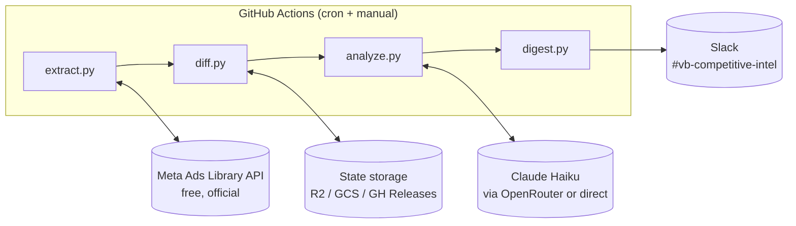

# VendorBids Competitive Intel: Revised Plan

Research-validated revision of the original plan. This version incorporates findings from deep-dive research into every component of the architecture (July 2026). This is a secondary plan, so some implementation choices are left open-ended where multiple viable options exist.

## What changed from the original plan

| Area | Original plan | Revised (with rationale) |
|------|--------------|--------------------------|
| **Data source** | Apify scraper ($29/mo + per-ad fees + proxy costs) | Official Meta Ads Library API (free, rate-limited to ~200 calls/hr) |
| **Scraping fragility** | Acknowledged quarterly breakage | Eliminated entirely. Official API is stable, versioned, maintained by Meta |
| **Slack delivery** | n8n webhook relay on Railway | Direct Slack integration (Incoming Webhook or Bot Token) |
| **State storage** | GCS bucket for SQLite sync | Open: GCS, Cloudflare R2, or GitHub Releases (see options below) |
| **FTS5 on CI** | Not addressed | Requires `pysqlite3-binary` due to broken FTS5 on GitHub Actions runners |
| **Cost estimate** | ~$36/month | ~$0.50/month (LLM cost only; everything else is free-tier) |
| **Legal framing** | "ToS-safe because transparency tool" | More nuanced: logged-out access is defensible per Meta v. Bright Data (2024), but not a blanket exemption. Official API avoids the question entirely |
| **Residential proxies** | Claimed included in Apify Starter | Not included ($8/GB extra). Moot now since we use the official API |

## Architecture (revised)



Key difference: the n8n relay is removed. The digest posts directly to Slack. State storage is an open choice (see section below).

## Data source: Meta Ads Library API

The single biggest change. The official API (`graph.facebook.com/<version>/ads_archive`) is free and provides everything we need for this use case.

### What the API gives us

- Search by advertiser Page ID (up to 10 at once) or keywords
- Filter by country, platform, media type, date range, active status
- Ad creative text, headlines, rendered preview snapshot URLs
- Cursor-based pagination with JSON responses
- Stable, versioned endpoints maintained by Meta

### What the API does NOT give us

- **Spend/impression data for US commercial ads** (returns null; only available for EU/UK-delivered ads and political/social-issue ads)
- **Engagement metrics** (likes, comments, shares) not available anywhere, not even the web UI
- **Direct image/video file downloads** (snapshot URL only, which is a rendered preview link)
- **Detailed targeting data** (interests, behaviors, custom audiences)

### Why this is fine

For the core question ("what ads are my competitors running, and how has that changed?"), the API gives us exactly what we need: creative copy, headlines, CTAs, active status, and start dates. Spend data would be nice but no tool provides accurate US commercial ad spend anyway; even Pathmatics and AdClarity estimate it from panels. The LLM analysis layer is what turns raw creative data into strategic insight, and it works on copy and themes, not spend numbers.

### API access requirements

- A Meta App with Ads Library API access (requires App Review)
- Meta Business Verification (5-10 business days)
- Long-lived access token (expires ~60 days, must be refreshed)
- Rate limit: ~200 calls/hour per token

**Open question:** Token refresh automation. Options include a scheduled GitHub Action that refreshes the token and stores it as a secret, or using a long-lived system user token via Meta Business Manager. This needs to be figured out during implementation.

### Fallback: Apify as a backup option

If the official API proves insufficient for any reason (e.g., App Review rejection, data gaps), Apify remains a viable fallback. Key corrections to the original plan's Apify assumptions:

- Use community actors (`curious_coder/facebook-ads-library-scraper` at $0.75/1K ads) instead of the official actor ($5/1K on Starter plan)
- Residential proxies are NOT included in the $29/mo Starter plan; they cost $8/GB extra
- Expect monthly breakage, not quarterly
- Budget ~$50-80/month total (subscription + per-ad fees + proxy bandwidth), not $36

## Slack delivery: direct integration

### Why drop n8n

The original plan routes through n8n on Railway solely to post a message to Slack. Research found:

- n8n's Slack node has well-documented Block Kit rendering bugs (blocks silently ignored, dynamic content fragility)
- Railway has had multiple major outages (including an 8-hour platform-wide outage in May 2026)
- Railway's serverless mode is explicitly documented as unsuitable for webhook processing
- Standing up n8n infrastructure solely to relay a weekly message is over-engineering

### Recommended: Slack Incoming Webhook

For a one-way "post a formatted report to a channel" use case, a Slack Incoming Webhook is the simplest option:

- Single HTTP POST with JSON body
- Fixed to one channel (which is exactly our use case: `#vb-competitive-intel`)
- Supports full Block Kit layout blocks
- Zero infrastructure, zero token management
- Setup: Slack App > Incoming Webhooks > Add to channel > copy URL

### Alternative: Slack Bot Token

Upgrade to a bot token + `chat.postMessage` if we later need:
- Threading (summary in main message, per-competitor details as thread replies)
- Message updates or deletions
- Multi-channel posting
- Interactive elements (buttons that trigger actions)

### Block Kit size limits (important)

| Limit | Value |
|-------|-------|
| Max blocks per message | 50 |
| Total payload size | 16 KB |
| Section block text | 3,000 chars |

With 10 competitors at 4-5 blocks each, we're at or near the 50-block limit. **Mitigation strategies (pick during implementation):**

- Split into multiple messages (critical competitors in one, adjacent/watch in another)
- Use threading: summary message + per-competitor thread replies
- Keep individual entries concise (2-3 blocks each)
- Only include critical and changed-adjacent competitors in the main message; roll up watch list into a single line

## State storage: open decision

Three viable options, each with different tradeoffs. All support the core pattern: download SQLite at job start, use it, push it back.

### Option A: Cloudflare R2 (recommended default)

- 10 GB free forever, zero egress fees
- S3-compatible API (use `boto3` or `aws s3 cp` which is pre-installed on GitHub Actions runners)
- No GCP service account setup needed
- No acceptable-use ambiguity

### Option B: GCS (if already in GCP ecosystem)

- ~$0.02/month or free under Always Free tier (us-east1/us-west1/us-central1)
- Requires GCP service account + key JSON in GitHub secrets
- Use `google-cloud-storage` Python library
- Use `if_generation_match` precondition on upload for optimistic locking

### Option C: GitHub Releases (simplest, zero-infrastructure)

- Upload with `gh release upload --clobber`
- Free, indefinite retention, 2 GB per asset
- No external accounts or credentials needed
- Downside: delete-then-reupload is non-atomic; grey area for non-release data

### Regardless of choice

- **Serialize workflow runs** with GitHub Actions `concurrency: { group: db-update, cancel-in-progress: false }`
- **Use `VACUUM INTO` before upload** to produce a clean, single-file backup (no WAL/SHM split)
- **Run `PRAGMA integrity_check` after download** as a safety net
- **Pin `pysqlite3-binary`** in requirements.txt to guarantee FTS5 support (GitHub Actions runners have a known open bug breaking FTS5: actions/runner-images#12576)

## LLM analysis: confirmed viable

OpenRouter + Claude Haiku 4.5 is validated as the right choice for this volume.

- **Cost:** ~$0.08-0.28/month for 40 analyses (the original $0.50 estimate was conservative)
- **Structured output:** OpenRouter supports `response_format: {"type": "json_object"}` and the stricter `json_schema` mode
- **Rate limits:** 40 calls/month is trivially within any provider's limits
- **Alternative providers:** Direct Anthropic API or AWS Bedrock cost the same at this volume; OpenRouter is fine for simplicity

The analysis prompt from the original plan is well-designed. No changes needed.

**Open question:** Whether to use OpenRouter, direct Anthropic API, or AWS Bedrock. At 40 calls/month the cost difference is negligible (fractions of a penny). Choose based on which credentials are easiest to manage.

## Cost model (revised)

| Line item | Monthly cost |
|-----------|-------------:|
| Meta Ads Library API | $0.00 |
| State storage (R2 free tier or GCS free tier) | $0.00 |
| OpenRouter / Claude Haiku (~40 analyses/month) | $0.08-0.50 |
| GitHub Actions (well under free tier at ~5 min/week) | $0.00 |
| Slack Incoming Webhook | $0.00 |
| **Total** | **~$0.50** |

Down from ~$36/month in the original plan. The Apify subscription + per-ad fees + proxy costs are eliminated entirely by using the official API.

If the Apify fallback is needed, budget ~$50-80/month (corrected from the original's $36 estimate).

## Build vs. buy: confirmed build

Research validated that building custom is the right call:

- **Crayon** (~$2,460/month) and **Klue** (~$2,500/month) don't track Meta ads at all. They focus on website changes, pricing, job postings. Wrong tool entirely.
- **AdSpy** ($149/month) has the deepest Meta ad database but no API for automation. Would still require manual weekly checks.
- **BigSpy Pro** ($99/month) has shallower coverage and mixed data quality reviews. Also no API for automated pipelines.
- **Semrush + AdClarity** ($320+/month) provides estimated panel data, not actual Meta data. 640x our revised cost.
- **Clay** ($54+/month) can pull Meta ads via Adyntel integration but is awkward for ongoing automated monitoring.

No commercial tool provides an API for automated Meta ad monitoring at a price point that makes sense for this scope. The custom pipeline is the right call.

### Open-source accelerators worth evaluating

| Project | What it does | How it could help |
|---------|-------------|-------------------|
| `AdDownloader` (pip) | Official API wrapper with CLI + Python package | Could replace `extract.py` entirely |
| `facebook-ads-library-mcp` | MCP server with 15+ tools for the API | Could be useful for ad-hoc research alongside the pipeline |
| n8n workflow template #11270 | No-code fetch + dedup + alert pipeline | Reference architecture, even if we don't use n8n |
| `NagaYu/AdRadar` | TypeScript monitoring pipeline with Slack/Discord alerts | Directly relevant as a reference implementation |

**Open question:** Whether to use `AdDownloader` as the extraction layer vs. writing `extract.py` from scratch. AdDownloader handles pagination, rate limiting, and data normalization, which would save a few days of development.

## Revised repo structure

```
vendorbids-competitive-intel/
├── .github/workflows/
│   ├── weekly-digest.yml         # scheduled + workflow_dispatch
│   └── backfill.yml              # one-time historical seed
├── src/
│   ├── main.py                   # entrypoint, orchestrates all stages
│   ├── extract.py                # Meta Ads Library API client (or AdDownloader wrapper)
│   ├── diff.py                   # SQLite state + change detection
│   ├── analyze.py                # LLM synthesis via OpenRouter
│   ├── digest.py                 # Slack Block Kit builder + direct POST
│   └── storage.py                # State sync (R2/GCS/GH Releases)
├── config/
│   └── competitors.yaml          # competitor list, threat levels, page IDs
├── prompts/
│   └── weekly_analysis.md        # LLM analysis prompt template
├── state/
│   └── ads.db                    # local dev only, prod syncs to cloud
├── .env.example
├── requirements.txt
└── README.md
```

Changes from original:
- `storage.py` is provider-agnostic (supports R2/GCS/GH Releases via config)
- `digest.py` posts directly to Slack (no n8n dependency)
- `extract.py` uses official API (not Apify)

## Data model

The SQLite schema from the original plan is sound. One addition:

```sql
-- Add to pipeline_runs table for token refresh tracking
CREATE TABLE api_tokens (
  provider TEXT PRIMARY KEY,       -- 'meta', 'openrouter', etc.
  token_hash TEXT NOT NULL,        -- SHA256 hash for change detection (never store raw)
  expires_at TIMESTAMP,
  last_refreshed TIMESTAMP,
  refresh_method TEXT              -- 'manual' | 'automated'
);
```

The FTS5 virtual table (`ads_fts`) is valuable for historical search but requires `pysqlite3-binary` on GitHub Actions. Pin it in requirements.txt:

```
pysqlite3-binary==0.5.4
requests==2.32.3
pyyaml==6.0.2
boto3==1.35.0              # if using R2
# google-cloud-storage==2.18.2  # if using GCS instead
python-dateutil==2.9.0
```

## Revised build timeline

### Week 1: pipeline plumbing

| Day | Deliverable |
|-----|-------------|
| 1 | Meta App creation, App Review submission, Business Verification started. Repo scaffold, `competitors.yaml` populated with page IDs |
| 2 | `extract.py` working against Meta Ads Library API for NetVendor + Revyse (or evaluate AdDownloader). Token refresh strategy decided |
| 3 | SQLite schema + `diff.py` with `pysqlite3-binary`. State storage provider chosen and `storage.py` implemented |
| 4 | `digest.py` with Slack Incoming Webhook, Block Kit message verified with real Slack post. Size limit mitigation chosen |
| 5 | `weekly-digest.yml` workflow with concurrency group, first end-to-end manual run via `workflow_dispatch` |

**Week 1 blockers to watch:**
- Meta App Review can take 5-10 business days. Start this on day 1. If not approved by day 2, develop against test data and swap in real API calls when approved
- Meta Business Verification (separate from App Review) also takes time. Start immediately

### Week 2: intelligence layer

| Day | Deliverable |
|-----|-------------|
| 6-7 | `analyze.py` + prompt template, tuned against real week-1 data |
| 8 | Rebuild `digest.py` with full Block Kit + LLM analysis output. Test against 50-block/16KB limits |
| 9 | Add remaining 8 competitors, tune theme consistency across all of them |
| 10 | Schedule Monday 8am cron, hand off first "real" digest to Jindou and Suki |

## Open questions (to resolve during implementation)

1. **State storage provider:** R2 vs GCS vs GitHub Releases. Recommendation is R2 unless already invested in GCP.

2. **LLM provider:** OpenRouter vs direct Anthropic API vs Bedrock. All cost the same at this volume. Pick based on credential management preference.

3. **Extraction layer:** Write `extract.py` from scratch vs wrap `AdDownloader`. AdDownloader saves time but adds a dependency.

4. **Meta token refresh:** Manual refresh every 60 days vs automated refresh via GitHub Action. Automated is better but adds complexity.

5. **Block Kit size mitigation:** Split messages vs threading vs condensed format. Depends on how Suki and Jindou prefer to read the digest.

6. **LinkedIn extension timing:** The original plan's LinkedIn roadmap is sound but should wait until the Meta pipeline is stable (4+ weeks of clean runs). The schema additions and new prompt are additive, not disruptive.

## Risk register

| Risk | Likelihood | Impact | Mitigation |
|------|-----------|--------|------------|
| Meta App Review rejected | Low | High (blocks everything) | Apply early. Fallback: Apify community actor at ~$50-80/mo |
| Meta token expires unnoticed | Medium | Medium (missed digest) | Automated refresh or calendar reminder. Pipeline posts failure alert to Slack |
| FTS5 breaks on GHA runner update | Medium | Low (non-critical feature) | `pysqlite3-binary` pins SQLite version independent of runner |
| LLM theme drift over time | High | Low | Monthly normalization pass (per original plan). Add canonical theme list to prompt |
| Block Kit payload exceeds 16KB | Medium | Low | Split into multiple messages or use threading |
| Competitor changes Facebook page | Low | Low | Manual update to `competitors.yaml` |

## Compliance notes (corrected)

The original plan's claim that Meta Ads Library is "ToS-safe because it's a transparency tool" is an oversimplification.

**Using the official API:** Fully compliant. This is Meta's sanctioned access method. No ToS concerns.

**If falling back to scraping:** Logged-out scraping of publicly available Meta data is legally defensible in the U.S. per Meta v. Bright Data (N.D. Cal., January 2024), where the court ruled Meta's ToS cannot bind logged-out scrapers. However:
- Meta's ToS Section 3.2 explicitly prohibits automated data collection for logged-in users
- GDPR exposure exists if operating in or targeting EU data subjects
- Meta can and does block scrapers technically regardless of legality

**Recommendation:** Use the official API. It's free, stable, and eliminates the legal question entirely.
